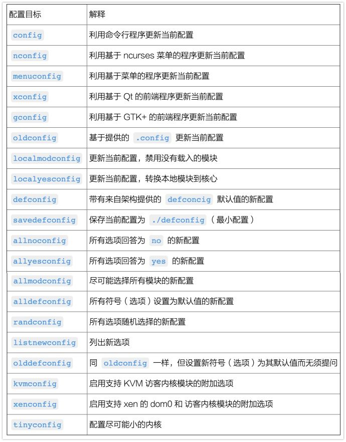

# light-build(v1.0)

## 用户指南:

LightBuild是一个上手简单的项目构建系统,适用于汇编/c/c++项目的项目构建


light-build是基于kbuild重构融合的完整编译框架，特性如下：

1. 递归混杂多项目编译，通过递归规则一个父可以生成多个子项目
2. 支持多种预定义编译规则,可以大大减少规则量
3. 支持多线程编译,自定义输出路径
4. 多种kconfig配置系统，可以自定义配置文件位置
5. 多种代码错误检查工具
6. 系统规则使用全路径模式

### 食用方法:

```bash
make 
make O=/path/			#定义输出路径
make V=1				#显示编译过程
make W=1				#开启编译提示
make -j16				#多线程编译
```

## 规则介绍:

​	编译规则包含一个主规则多个副规则和辅助规则.


#### always规则:

​	always规则的内容往往会在make之后自动执行,衍生出了很多组合规则,比如:

```
always-y += abc
abc: 
	echo "hello,world"
```

运行结果会输出"hello,world"

```
cust-always-y +=
cust += abc
```

运行会编译abc.c


1. obj规则:

   ```
   obj-y += hello.o
   ```

   obj规则下系统会自动匹配目标

   

2. nasm*规则:

   一件生成nasm

   

3. cust*规则:


5. elf*规则:


6. bin*规则:


7. host*规则:


## Kconfig使用方法



## 附录一:    系统规则

```

```

## 附录二:    系统命令


## 附录三:    参与开发

为了保证源码观看效果,请把制表符宽度调整为4 !!!

添加模块

### 联系方式

E-mail : 1512819690@qq.com

QQ ：1512819690